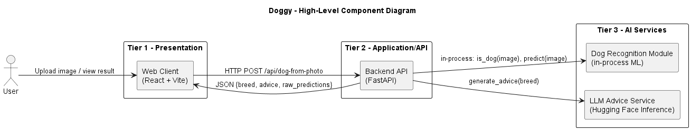
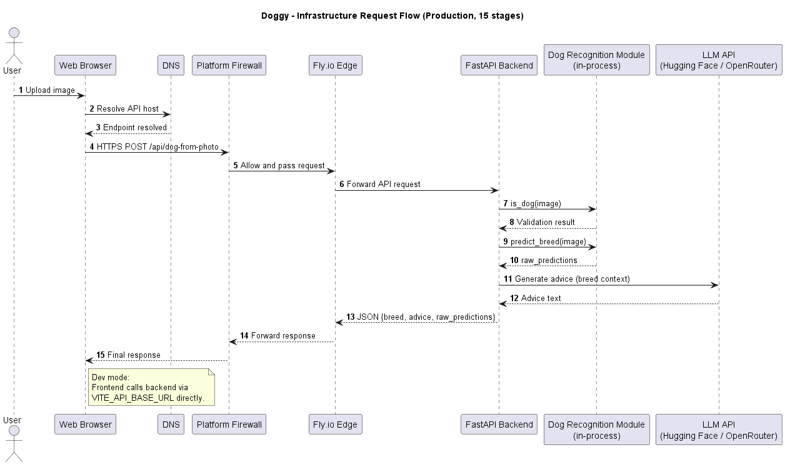
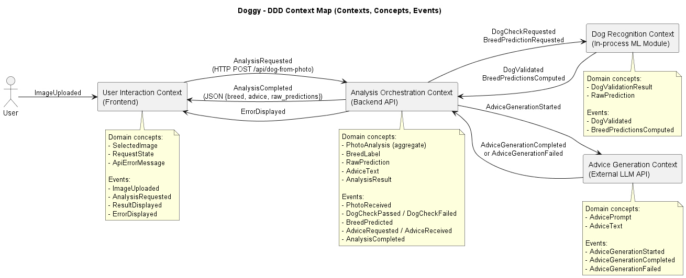
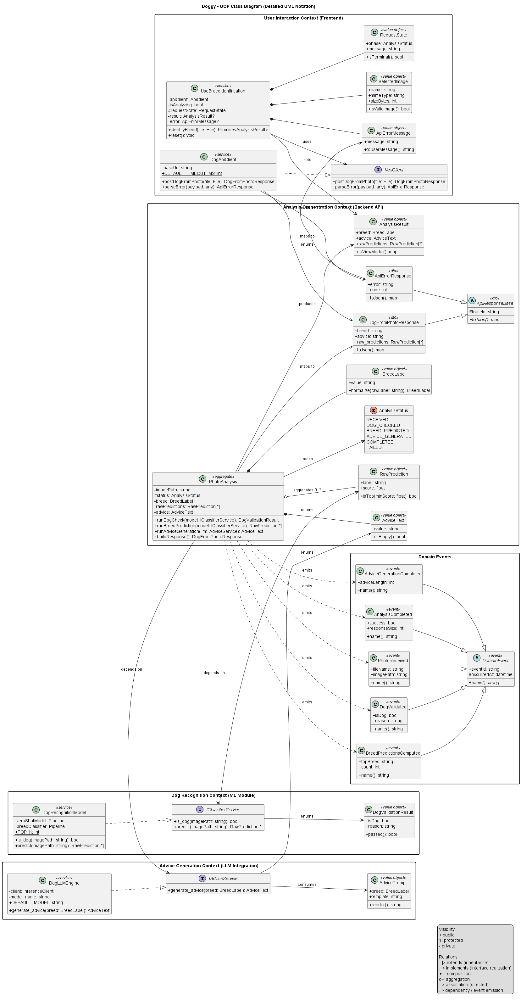

# Design

This chapter explains the strategies used to meet the requirements identified in the analysis. 
## Architecture 

### Architectural style

We adopt a **layered client-server architecture**.

Why this style:
- clear separation of concerns between UI, API orchestration, and AI logic
- straightforward local and cloud deployment
- good testability at both API and component level
- independent frontend/backend evolution

Why not alternatives (for current scope):
- not **event-based**: the workflow is synchronous request/response, with no queue or event stream
- not **shared-dataspace**: there is no shared persistent data core that coordinates components
- not **microservice/object-based distributed decomposition**: current project size does not justify added operational complexity

### Chosen structure

We use a **3-tier N-tier structure**:
- **Tier 1 (Presentation)**: React + Vite web client for user interaction, image upload, and result rendering
- **Tier 2 (Application/API)**: FastAPI backend for input validation, orchestration, and error handling
- **Tier 3 (AI Services)**: dog recognition model and LLM advice engine invoked by the backend

This structure keeps the runtime simple while preserving clear boundaries for future extensions.

### High-level overview

The user interacts with the web client, which sends HTTP requests to the backend.
The backend coordinates dog recognition and advice generation, then returns one aggregated response (`breed + advice + raw_predictions`) to the client.

### Component responsibilities

- **User**: provides input image and consumes results
- **Web Client (React + Vite)**: collects user input, sends API requests, renders results and errors
- **Backend API (FastAPI)**: exposes endpoints, validates requests, orchestrates analysis flow, aggregates final response
- **Dog Recognition Module (in backend runtime)**: checks if the image contains a dog and predicts breed labels
- **LLM Advice Service (external API via backend)**: generates textual recommendations for the predicted breed

## Infrastructure

Doggy uses a **client-server** setup.

### Used infrastructure components

- **Clients (web browsers) - Frontend side**  
  Interaction: user works in browser; browser loads UI and sends API requests.

- **Servers - Frontend and Backend**  
  Interaction: Vite serves frontend locally in development; FastAPI receives `/api/*` requests and calls external AI APIs.

- **External AI service (LLM provider API) - Backend outbound dependency**  
  Interaction: FastAPI sends HTTPS inference requests and receives generated recommendations.

- **Load balancer / ingress (Fly.io edge) - Backend entry point**  
  Interaction: receives public HTTPS traffic and routes requests to the FastAPI app instance.

- **Proxy (Fly.io edge reverse proxy) - Between Frontend and Backend**  
  Interaction: forwards request/response traffic between browser and FastAPI.

- **Firewalls (platform-managed) - Backend perimeter**  
  Interaction: Fly.io network controls filter internet traffic before it reaches the app service.

- **DNS - Name resolution service**  
  Interaction: browser resolves public hostnames before sending requests.

- **Backend endpoint configuration - Frontend to Backend binding**  
  Interaction: frontend calls backend URL from `VITE_API_BASE_URL` (development) or public URL (production).

### Network interaction process

1. The user uploads an image in the browser.
2. The browser resolves the API host via DNS.
3. DNS returns the target endpoint.
4. The browser sends an HTTPS request to the platform firewall boundary.
5. The firewall layer allows and passes traffic to Fly.io edge.
6. Fly.io edge proxies the request to the FastAPI backend.
7. FastAPI invokes the in-process dog-recognition module to verify that the image contains a dog.
8. The dog-recognition module returns the validation result.
9. FastAPI invokes the same module for breed prediction.
10. The dog-recognition module returns breed probabilities (`raw_predictions`).
11. FastAPI sends breed context to the external LLM provider API.
12. LLM provider API returns generated recommendations.
13. FastAPI builds the final JSON response (`breed`, `advice`, `raw_predictions`).
14. Fly.io edge forwards the response back through the platform boundary.
15. The browser receives and renders the final result.

Development note: in local mode, the frontend uses `VITE_API_BASE_URL` to call the backend directly (without the public production ingress path).

### Request flow (UML Sequence)

## Modelling

### Domain driven design (DDD) modelling

#### Bounded contexts and domain concepts

- **User Interaction Context (Frontend)**: image upload, request trigger, result/error rendering.  
  - value objects `SelectedImage`, `RequestState`, `ApiErrorMessage`
  - service `useBreedIdentification`
  - relevant events `ImageUploaded`, `AnalysisRequested`, `ResultDisplayed`, `ErrorDisplayed`

- **Analysis Orchestration Context (Backend API)**: request lifecycle orchestration and response aggregation.  
  - ephemeral aggregate `PhotoAnalysis`
  - value objects `BreedLabel`, `RawPrediction`, `AdviceText`, `AnalysisResult`
  - application service `/api/dog-from-photo`
  - factories/initialization `_get_dog_model()`, `_get_llm()`
  - repositories: not used (no persistent domain storage)
  - relevant events `PhotoReceived`, `DogCheckPassed` / `DogCheckFailed`, `BreedPredicted`, `AdviceRequested`, `AdviceReceived`, `AnalysisCompleted`

- **Dog Recognition Context (ML module)**: dog/non-dog validation and breed prediction.  
  - value objects `DogValidationResult`, `RawPrediction`
  - service `DogRecognitionModel` (`is_dog()`, `predict()`)
  - relevant events `DogValidated`, `BreedPredictionsComputed`

- **Advice Generation Context (LLM integration)**: breed-specific recommendation generation.  
  - value objects `AdvicePrompt`, `AdviceText`
  - service `DogLLMEngine.generate_advice()`
  - relevant events `AdviceGenerationStarted`, `AdviceGenerationCompleted`, `AdviceGenerationFailed`

Repositories/factories note: repositories are not used in the current scope (no persistent domain storage), and no dedicated domain factories are required beyond service initialization (`_get_dog_model()`, `_get_llm()`).

### Object-oriented modelling

#### Main data types, attributes, and methods

**Frontend context**

| Type | Kind | Responsibility | Main attributes | Main methods |
| --- | --- | --- | --- | --- |
| `UseBreedIdentification` | service | Orchestrates the UI-side analysis lifecycle | `isAnalyzing`, `result`, `error`, `requestState` | `identifyBreed(file)`, `reset()` |
| `DogApiClient` | service | Sends HTTP requests to backend and parses API errors | `baseUrl` | `postDogFromPhoto(file)`, `parseError(payload)` |
| `SelectedImage` | value object | Encapsulates uploaded image metadata | `name`, `mimeType`, `sizeBytes` | `isValidImage()` |
| `RequestState` | value object | Tracks the current request phase in UI | `phase`, `message` | `isTerminal()` |
| `ApiErrorMessage` | value object | Stores normalized user-facing error text | `message` | `toUserMessage()` |

**Backend orchestration context**

| Type | Kind | Responsibility | Main attributes | Main methods |
| --- | --- | --- | --- | --- |
| `PhotoAnalysis` | aggregate | Orchestrates per-request backend workflow and result assembly | `imagePath`, `status`, `breed`, `rawPredictions`, `advice` | `runDogCheck()`, `runBreedPrediction()`, `runAdviceGeneration()`, `buildResponse()` |
| `BreedLabel` | value object | Stores normalized top breed label | `value` | `normalize(rawLabel)` |
| `RawPrediction` | value object | Represents one classifier prediction item | `label`, `score` | `isTop(minScore)` |
| `AdviceText` | value object | Stores generated recommendation text | `value` | `isEmpty()` |
| `AnalysisResult` | value object | Holds internal merged analysis output | `breed`, `advice`, `rawPredictions` | `toViewModel()` |
| `DogFromPhotoResponse` | DTO | Defines public success response schema | `breed`, `advice`, `raw_predictions` | `toJson()` |
| `ApiErrorResponse` | DTO | Defines public error response schema | `error`, `code` | `toJson()` |

**Dog recognition context**

| Type | Kind | Responsibility | Main attributes | Main methods |
| --- | --- | --- | --- | --- |
| `DogRecognitionModel` | domain service | Performs dog validation and breed classification | `zeroShotModel`, `breedClassifier` | `is_dog(imagePath)`, `predict(imagePath)` |
| `DogValidationResult` | value object | Encodes dog/not-dog decision and reason | `isDog`, `reason` | `passed()` |

**Advice generation context**

| Type | Kind | Responsibility | Main attributes | Main methods |
| --- | --- | --- | --- | --- |
| `DogLLMEngine` | domain service | Calls LLM provider and returns advice text | `client`, `model_name` | `generate_advice(breed)` |
| `AdvicePrompt` | value object | Builds prompt payload for advice generation | `breed`, `template` | `render()` |

**Domain events**

| Type | Kind | Responsibility | Main attributes | Main methods |
| --- | --- | --- | --- | --- |
| `DomainEvent` | abstract event | Provides common event metadata contract | `eventId`, `occurredAt` | `name()` |
| `PhotoReceived` | event | Captures beginning of backend analysis lifecycle | `fileName`, `imagePath` | `name()` |
| `DogValidated` | event | Captures outcome of dog/non-dog verification | `isDog`, `reason` | `name()` |
| `BreedPredictionsComputed` | event | Captures completion of breed prediction stage | `topBreed`, `count` | `name()` |
| `AdviceGenerationCompleted` | event | Captures completion of LLM advice generation | `adviceLength` | `name()` |
| `AnalysisCompleted` | event | Captures final request completion state | `success`, `responseSize` | `name()` |

#### Relationships between data types

- `UseBreedIdentification` sends request and receives `DogFromPhotoResponse` / `ApiErrorResponse`.
- `PhotoAnalysis` composes `BreedLabel`, `RawPrediction`, `AdviceText`, and produces `AnalysisResult`.
- `PhotoAnalysis` depends on `DogRecognitionModel` and `DogLLMEngine`.
- `DogRecognitionModel` creates `DogValidationResult` and `RawPrediction`.
- `DogLLMEngine` consumes `AdvicePrompt` and returns `AdviceText`.
- `PhotoAnalysis` lifecycle is reflected by domain events (`PhotoReceived` -> `AnalysisCompleted`).

## Interaction

- How do components *communicate*? *When*? *What*?

- Which **interaction patterns** do they enact?

> UML sequence diagrams are welcome here

## Behaviour

- How does **each** component *behave* individually (e.g., in *response* to *events* or messages)?
    + Some components may be *stateful*, others *stateless*

- Which components are in charge of updating the **state** of the system? *When*? *How*?

> UML state diagrams or activity diagrams are welcome here

## Data-related aspects (in case persistent storage is needed)

- Is there any data that needs to be stored?
    - *What* data? *Where*? *Why*?

- How should **persistent data** be **stored**? Why?
    - e.g., relations, documents, key-value, graph, etc.

- Which components perform queries on the database?
    - *When*? *Which* queries? *Why*?
    - Concurrent read? Concurrent write? Why?

- Is there any data that needs to be shared between components?
    - *Why*? *What* data?
